<p align="center">
  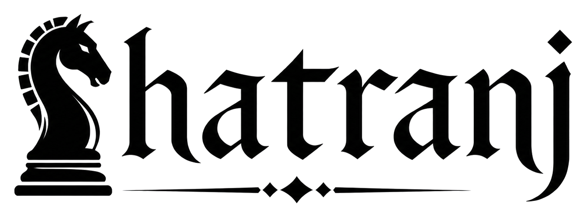
</p>

<p align="center">
  <strong>Shatranj. The first online chess for a real ZX Spectrum 48K.</strong><br>
  Two machines, anywhere in the world, on the same board.
</p>

<p align="center">
  
  
  
  
  
</p>

<p align="center">
  <a href="README.es.md">Espa&ntilde;ol</a> &middot;
  <a href="CHANGELOG.md">Changelog</a> &middot;
  <a href="client/README.md">PC client notes</a>
</p>

---

Since 1982 the ZX Spectrum has played chess against its own ROM, against a
cassette, against the person sitting next to it. It never played chess across a
network. **Shatranj is the first time it does.**

Two real Spectrums, on opposite sides of the internet, sharing one board over
divMMC and an ESP-AT link. Or a Spectrum against the bundled PC client when
there is only one machine in the room. The same wire protocol drives both ends.

Everything a full game needs is here — setup screens, side selection, move
entry, clocks, chat, draw and resign, restart and reset — and all of it lives
inside 48K of RAM.

### At a glance

|  |  |
| --- | --- |
| **Play** | Spectrum vs Spectrum, or Spectrum vs PC |
| **Connect** | Direct TCP for reachable peers · MQTT across NAT/CGNAT |
| **Board** | Three 16×16 piece sets · five palettes · optional legal-move hints |
| **In game** | Clocks, move history, chat, `/draw`, `/resign` |
| **Hardware** | divMMC/esxDOS · ESP-AT UART · the whole application inside 48K |

### Contents

- [Gallery](#gallery)
- [Piece Sets And Board Themes](#piece-sets-and-board-themes)
- [The Application](#the-application)
- [Using Shatranj](#using-shatranj)
- [Spectrum Build](#spectrum-build)
- [PC Client Build](#pc-client-build)
- [Network Modes](#network-modes)
- [Hardware And Toolchain Profile](#hardware-and-toolchain-profile)
- [Repository Map](#repository-map)
- [Documentation](#documentation)
- [Acknowledgements](#acknowledgements)
- [License](#license)
- [Author](#author)

## Gallery

<table>
  <tr>
    <td align="center" width="33%">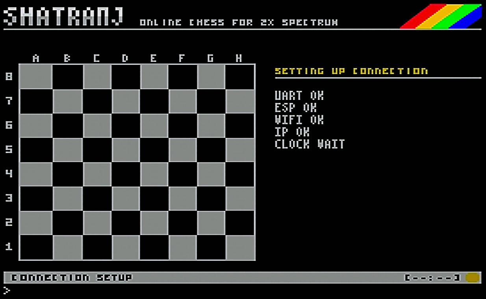<br><sub>Main screen</sub></td>
    <td align="center" width="33%">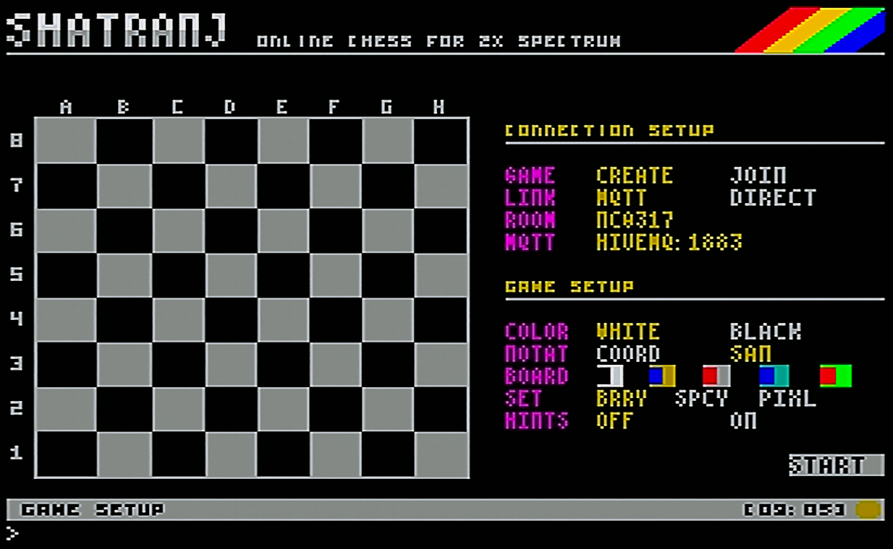<br><sub>Game setup</sub></td>
    <td align="center" width="33%">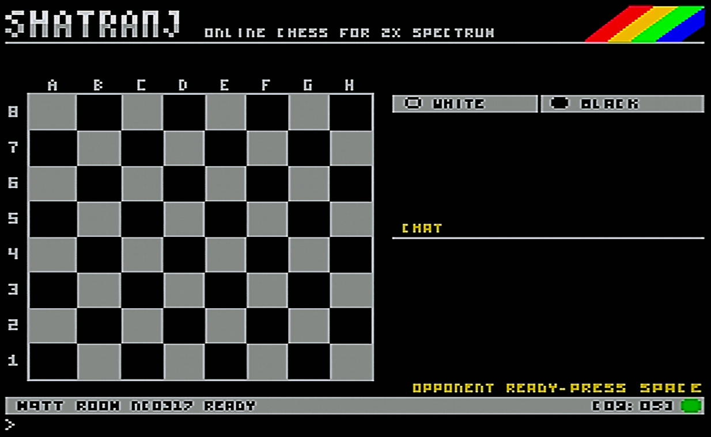<br><sub>Game in progress</sub></td>
  </tr>
  <tr>
    <td align="center" width="33%">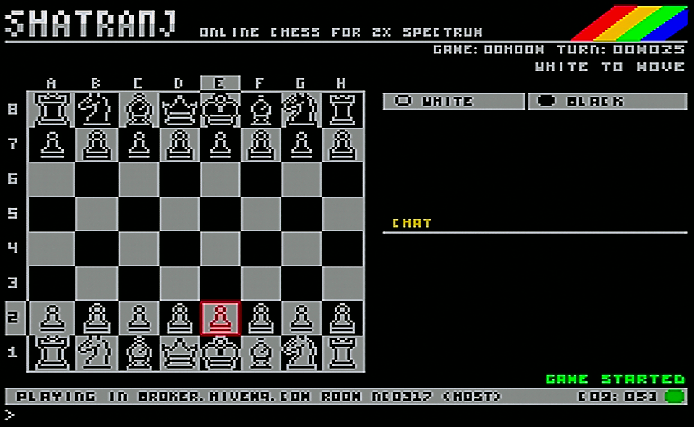<br><sub>Network setup</sub></td>
    <td align="center" width="33%">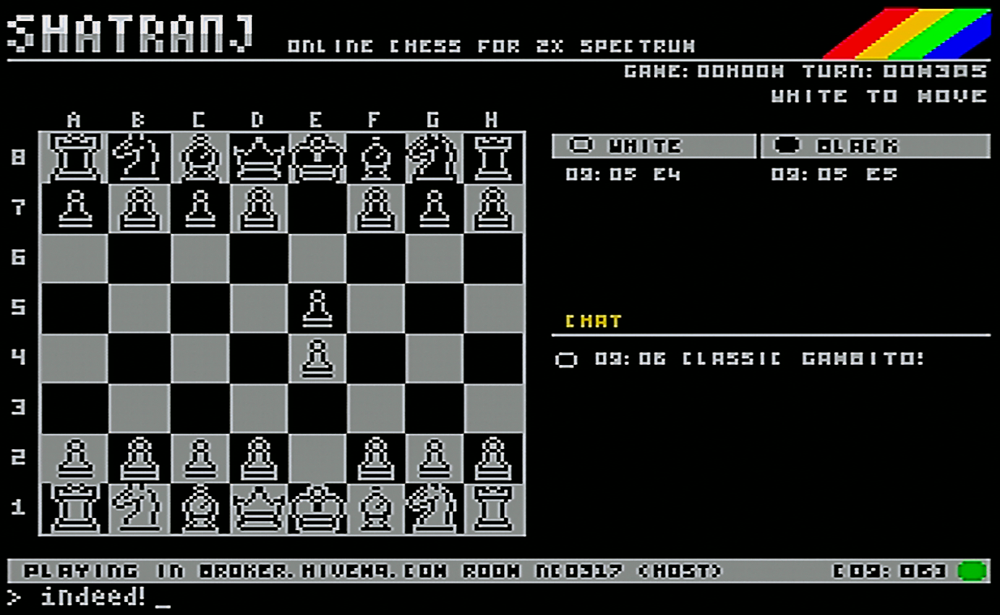<br><sub>Chat and move log</sub></td>
    <td align="center" width="33%">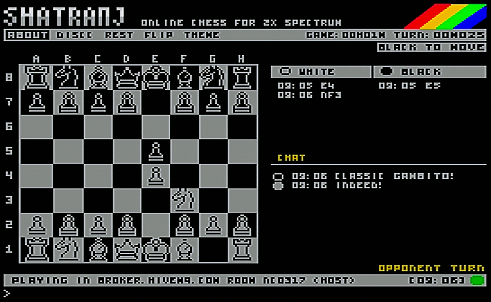<br><sub>Clocks and status</sub></td>
  </tr>
  <tr>
    <td align="center" width="33%">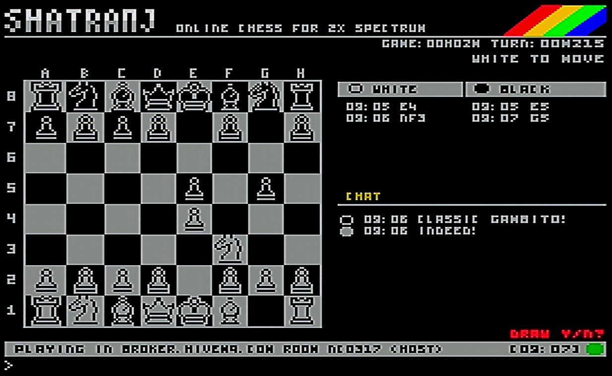<br><sub>Move history</sub></td>
    <td align="center" width="33%">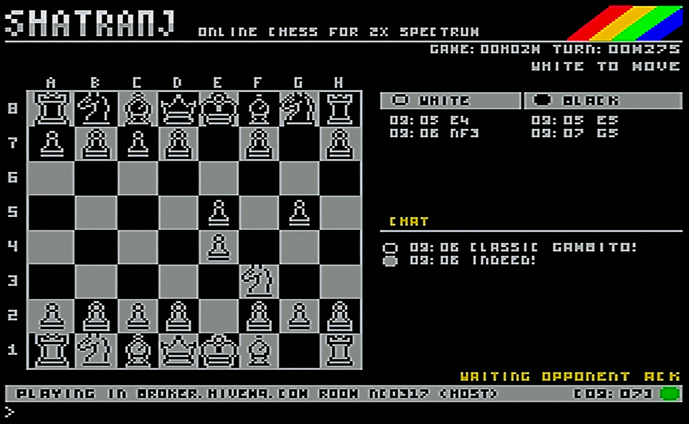<br><sub>Local input</sub></td>
    <td align="center" width="33%">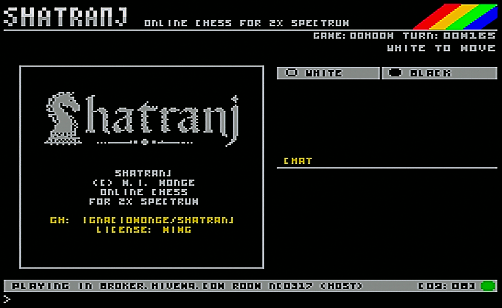<br><sub>Game dialog</sub></td>
  </tr>
  <tr>
    <td align="center" width="33%">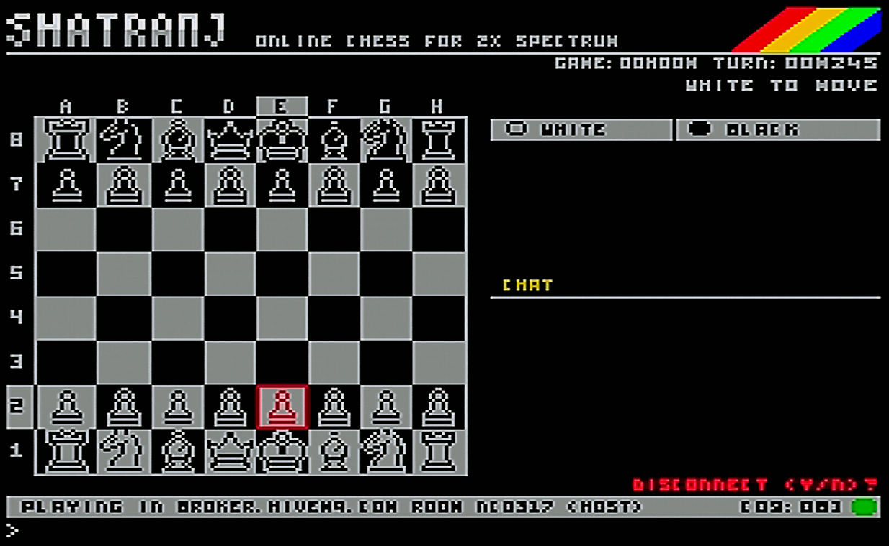<br><sub>Play screen</sub></td>
    <td align="center" width="33%">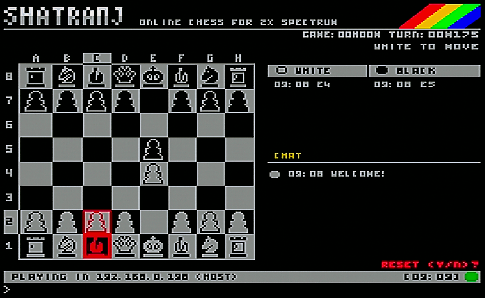<br><sub>PC client</sub></td>
    <td align="center" width="33%">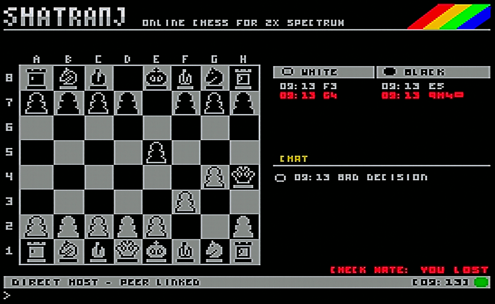<br><sub>Final view</sub></td>
  </tr>
</table>

## Piece Sets And Board Themes

The Spectrum build includes three 16x16 piece sets: **BRRY**, **SPCY**, and **PIXL**. Game Setup also exposes five board palettes: **Classic**, **Blue**, **Green**, **Cyan**, and **Magenta**.

<p align="center">
  
</p>

<table>
  <tr>
    <td align="center" width="25%">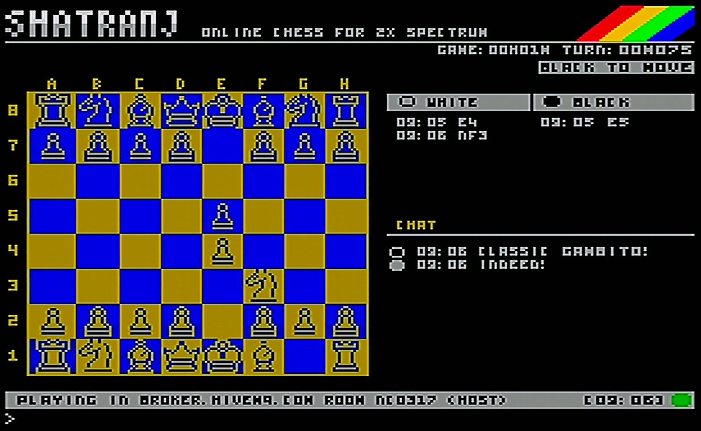<br><sub>Classic</sub></td>
    <td align="center" width="25%">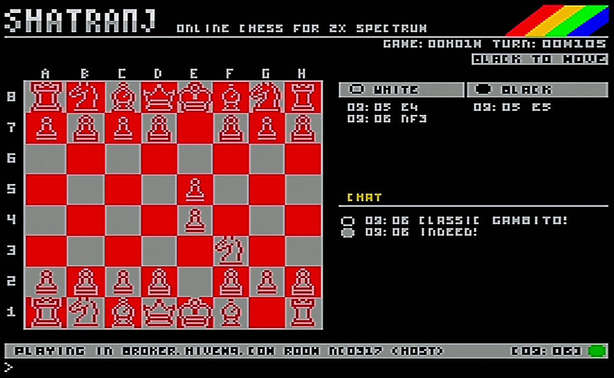<br><sub>Blue</sub></td>
    <td align="center" width="25%">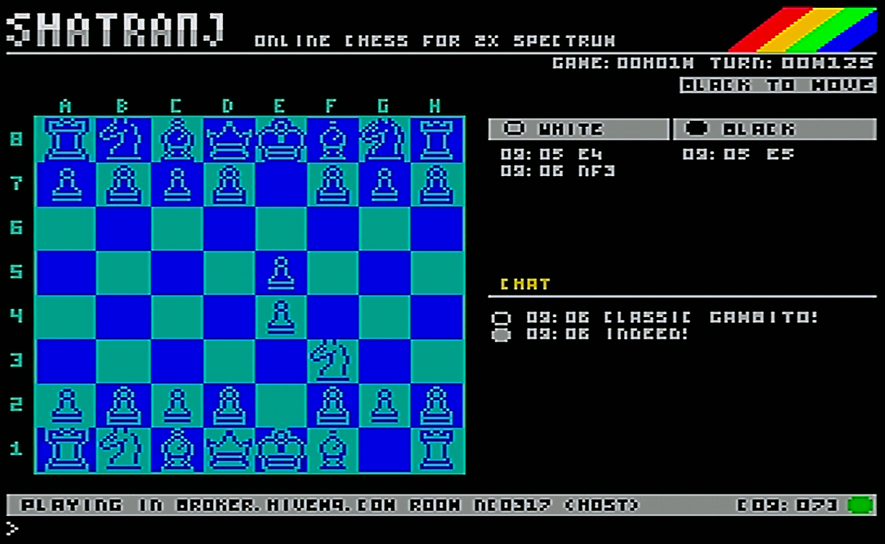<br><sub>Cyan</sub></td>
    <td align="center" width="25%">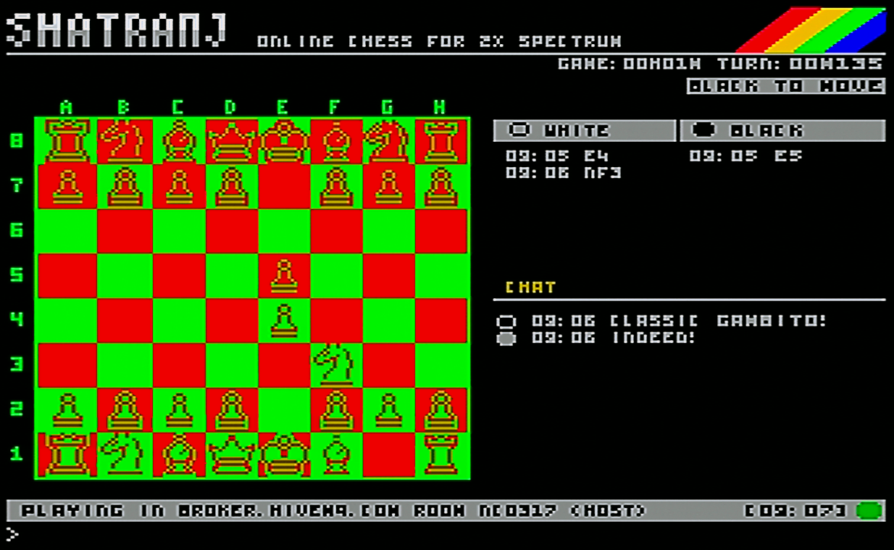<br><sub>Magenta</sub></td>
  </tr>
</table>

## The Application

Shatranj can be played in two pairings:

- **Spectrum-Spectrum**: two network-connected Spectrum machines run the Spectrum client and play by Direct TCP or MQTT.
- **Spectrum-PC**: one Spectrum plays against the included Qt desktop client, useful for mixed sessions, testing, or when only one real Spectrum is available.

The Spectrum client is the main target: it owns the board UI, setup flow, move entry, clocks, chat, runtime assets, and overlay dispatch. The PC client speaks the same wire protocol and provides a practical modern endpoint for Direct TCP or MQTT games.

All peers speak the same wire vocabulary: setup, host/join, game start, moves, ACK/NACK, chat, ping, reset, draw, and resign. The protocol is intentionally readable because hardware debugging is already hard enough.

## Using Shatranj

### Spectrum menus

The Spectrum side is driven from the setup screens before the board appears.

- **Connection Setup** chooses the transport and endpoint: Direct TCP or MQTT, Host or Guest, host/broker, port, and room code.
- **Game Setup** chooses the side/color policy, notation, board theme, piece set, and hints.
- **Tab** switches between the editable setup fields/options. Cursor keys change the focused option; text fields use the normal Spectrum input line.
- The **Host** starts the game once the peer is linked. The Guest waits for `GAME START` and acknowledges it.

### During a game

- Type a coordinate move such as `e2e4` and send it when it is your turn.
- Type any other text to send it as chat.
- Chat is intentionally short: the same two-line Spectrum envelope is enforced on both PC and Spectrum.
- `/draw` offers a draw.
- `/resign` resigns the game.
- Reset/restart requests are acknowledged by the opponent; the UI keeps the session visible instead of silently jumping state.

### PC client

- Select Direct or MQTT to match the Spectrum setup.
- In Direct mode, connect to the Spectrum host IP and port shown/configured on the Spectrum side.
- In MQTT mode, use the same broker, port, room, and Host/Guest split.
- The board can be played by clicking source and target squares; the chat box also accepts `/draw` and `/resign`.
- The RX/TX log is useful when testing real hardware because the wire protocol is deliberately readable.

## Spectrum Build

```sh
make tap PORT=5000
```

Copy the three release files together:

```text
release/SHATRANJ.tap
release/SHATRANJ.OVL
release/SHATRANJ.DAT
```

`SHATRANJ.tap` is not enough on its own. The OVL file carries cold code paths, and the DAT file carries runtime assets. If the DAT file is missing, corrupt, or from the wrong build, the Spectrum stops at boot with a red border and `DAT?`. That is intentional: a loud failure is safer than running with mismatched assets.

## PC Client Build

```sh
make client
```

Windows packages the executable here:

```text
release/shatranj-client/shatranj-client.exe
```

The Makefile chooses the best available backend. Windows uses the MSVC/Qt deployment script. macOS and Linux use CMake when available and fall back to qmake.

## Network Modes

### Direct TCP

Direct mode is for a reachable peer on a local network or forwarded port.

```text
HELLO DIRECT HOST|GUEST
GAME START WHITE=HOST|GUEST
MOVE <ply> <move>
ACK <ply>
NACK <ply>
CHAT <text>
PING / ACK PING
```

### MQTT

MQTT mode is for broker-mediated play, useful when peers sit behind NAT or CGNAT.

```text
H W|B <sid>
J <sid>
GAME START
MOVE / ACK / NACK / CHAT
PING / ACK PING
```

MQTT PUBACK is not treated as a game acknowledgement. Shatranj uses application-level ACK/NACK messages so both peers agree on game state, not merely packet delivery.

## Hardware And Toolchain Profile

- ZX Spectrum 48K target.
- z88dk `zcc` + SDCC, `sdcc_iy`, `--opt-code-size`, `--fomit-frame-pointer`.
- ROM IM1; handwritten ASM treats IY as reserved for the ROM contract.
- esxDOS/divMMC overlay loading.
- divMMC/ZX-Uno-compatible UART path for ESP-AT networking.
- Fixed low-RAM regions for move log, chat log, clocks, board state, overlay context, and hints.
- Build guards for SDCC/IY ABI, low-RAM overlap, module layering, overlay entry ABI, overlay size, resident size, and stack margin.

## Repository Map

| Path | Purpose |
| --- | --- |
| `src/spectrum/` | Spectrum application, UI, transport, session, setup, and overlays |
| `asm/` | Handwritten Z80: rendering, UART, esxDOS loader, overlay entries |
| `src/common/` | Shared chess, protocol, MQTT, and session helpers |
| `src/pc/`, `client/` | Qt desktop client and build wrappers |
| `assets/` | Spectrum runtime assets, piece sets, and about-screen data |
| `tests/` | Host tests for protocol, session, chess, and Spectrum boundaries |
| `tools/` | Asset generation, overlay generation, size reports, ABI and layering guards |

## Documentation

- [CHANGELOG.md](CHANGELOG.md) - release notes for 1.0.
- [README.es.md](README.es.md) - Spanish README.
- [client/README.md](client/README.md) - PC client build and hardware testing notes.
- [docs/source-layout.md](docs/source-layout.md) - source tree and ownership boundaries.
- [docs/architecture-decisions.md](docs/architecture-decisions.md) - durable architecture decisions.
- [docs/mqtt-session-policy.md](docs/mqtt-session-policy.md) - MQTT session policy.

## Acknowledgements

- **BRRY pieces**: based on [Chess Pieces 16x16 One-bit](https://berryarray.itch.io/chess-pieces-16x16-one-bit) by [BerryArray](https://berryarray.itch.io).
- **SPCY pieces**: based on [Chess Pieces](https://spicygame.itch.io/chess-pieces) by [Spicy Game](https://spicygame.itch.io).
- **PIXL pieces**: based on [Pixel Art Chess Pieces](https://benrosen.github.io/posts/pixel-art-chess-pieces/) by [Ben Rosen](https://benrosen.github.io).
- **Ikkle font**: [Ikkle 4](https://www.dafont.com/es/ikkle-4.font) by Brixdee, used as the basis for the compact Spectrum UI text.
- **mcu-max**: MIT-licensed low-resource chess engine by [Gissio](https://github.com/Gissio), kept under `third_party/mcu-max` with its upstream license.

## License

Shatranj is free software released under the GNU General Public License v2.0.

Third-party code and assets retain their upstream licenses and credits; see Acknowledgements.

## Author

M. Ignacio Monge Garcia - 2026

Connecting the ZX Spectrum to online chess since 2026.
