<p align="center">
  <picture>
    <source media="(prefers-color-scheme: dark)" srcset="docs/assets/shatranj-logo-dark.png">
    <source media="(prefers-color-scheme: light)" srcset="docs/assets/shatranj-logo-light.png">
    
  </picture>
</p>

<p align="center">
  <strong>Online chess across the ZX Spectrum family and modern desktops.</strong><br>
  Direct TCP or MQTT · ZX Spectrum Classic, Next, and Spectranext · Windows, macOS, and Linux
</p>

<p align="center">
  
  
  
  
  
</p>

<p align="center">
  <a href="README.es.md">Español</a> ·
  <a href="https://github.com/IgnacioMonge/Shatranj/releases/latest">Download</a> ·
  <a href="docs/README.md">Developer documentation</a> ·
  <a href="client/README.md">Qt client guide</a>
</p>

---

Shatranj lets two people play network chess from an original 48K Spectrum, a
Spectrum Next, a Spectrum fitted with a Spectranext cartridge, or the Qt
desktop client on Windows, macOS, and Linux. Every client uses the same game
protocol and chess rules, so any supported platform can play against any other.

Play Spectrum-to-Spectrum, Spectrum-to-desktop, or desktop-to-desktop. Use a
direct connection when the guest can reach the host, or meet in an MQTT room
when a direct connection is impractical. No account or central game server is
required.

## Why Shatranj

|  |  |
| --- | --- |
| **Play** | Spectrum ↔ Spectrum, Spectrum ↔ desktop, or desktop ↔ desktop |
| **Connect** | Direct TCP without a broker, or MQTT through a shared broker and room |
| **Platforms** | ZX Spectrum Classic, Spectrum Next, Spectranext, Windows, macOS, and Linux |
| **In game** | Legal-move hints, clocks, history, chat, draw, resign, takeback, and save/restore |
| **Consistent play** | The same rules, protocol, saved games, and session behavior on every client |
| **Native retro builds** | TAP + OVL + DAT for Classic and Spectranext; one self-contained NEX for Next |

## What's new in 1.2

- **Spectranext joins the board:** a native cartridge edition with Direct TCP,
  MQTT, RTC, persistent storage, and a guided installer.
- **Spectrum setup remembers you:** connection, clock, color, notation, board,
  pieces, and hints can all be saved, with live board and piece previews.
- **Faster retro interaction:** smoother setup navigation and typing, instant
  theme changes, faster board redraws, and clearer clock/startup feedback.
- **A sharper desktop client:** refreshed Qt presentation, faster board and
  network updates, and clearer connection and game-result messages.
- **Know who you are playing:** active games now identify the opponent's
  platform, from ZX Spectrum clients to the Qt desktop application.
- **Safer play:** more reliable saved games, reconnections, restored games,
  takebacks, rematches, and mixed-platform play.

See the [release notes](CHANGELOG.md) for the complete 1.2 overview.

## Contents

- [What's new in 1.2](#whats-new-in-12)
- [Platforms and protocols](#platforms-and-protocols)
- [Download](#download)
- [Installation](#installation)
- [Quick start](#quick-start)
- [Gallery](#gallery)
- [Piece sets and board themes](#piece-sets-and-board-themes)
- [Using Shatranj](#using-shatranj)
- [Build from source](#build-from-source)
- [Development](#development)
- [Credits and license](#credits-and-license)

## Platforms and protocols

| Client | Platforms | Network modes | Distribution |
| --- | --- | --- | --- |
| Qt desktop | Windows, macOS, Linux | Direct TCP, MQTT | Platform package or executable |
| ZX Spectrum Classic | 48K ZX Spectrum | Direct TCP, MQTT | `SHATRANJ.tap` + `SHATRANJ.OVL` + `SHATRANJ.DAT` |
| Spectrum Next | ZX Spectrum Next | Direct TCP, MQTT | `SHATRANJ.nex` |
| Spectranext | ZX Spectrum with Spectranext cartridge | Direct TCP, MQTT | Spectranext installer package |

Direct TCP is a peer connection: the guest must be able to reach the host's
address and port. MQTT avoids requiring a direct inbound connection; both
clients connect to the same broker and room instead.

### Spectrum hardware

Network play on Classic and Next uses a supported UART-to-ESP link with ESP-AT
firmware 1.7.6. The Classic build also needs divMMC/esxDOS to load its OVL and
DAT companions. A ZX-Uno-compatible UART requires ESP transmit flow control
via CTS; [NetMan](https://github.com/nihirash/netman-zx) configures the required
setting. The Next release is self-contained, so only its NEX file needs to be
copied. The Spectranext edition uses the cartridge's own networking, requires
the latest stable cartridge firmware, and is installed as a resource.

## Download

Download ready-to-run builds from the
[latest public release](https://github.com/IgnacioMonge/Shatranj/releases/latest).
Choose the desktop package for your operating system, the three-file Classic
set, the self-contained Next NEX, or the Spectranext cartridge installer.

## Installation

### Desktop

Download the package for Windows, macOS, or Linux, extract it if necessary,
and start Shatranj. No Spectrum hardware is required for desktop-to-desktop
games.

### ZX Spectrum Classic

Copy `SHATRANJ.tap`, `SHATRANJ.OVL`, and `SHATRANJ.DAT` into the same directory
on the divMMC card, keep their names unchanged, and load `SHATRANJ.tap`.

### Spectrum Next

Copy `SHATRANJ.nex` to the Next SD card and launch it from the NextZXOS browser.

### Spectranext cartridge

1. Update the cartridge to the **latest stable Spectranext firmware**, then
   configure the cartridge and Wi-Fi using the
   [official Spectranext instructions](https://docs.spectranext.net/tutorials/setting-up-mounts).
2. In the Spectranext menu, select **Load Resource URL** and enter:
   <code>https://ignaciomonge.github.io/Shatranj/</code>
3. The guided installer installs Shatranj in the cartridge's local storage and
   launches it.
4. Afterwards, start `SHATRANJ.ZX` from local XFS. To update Shatranj, use
   **Load Resource URL** again; your configuration and saved games are
   preserved.

<p align="center">
  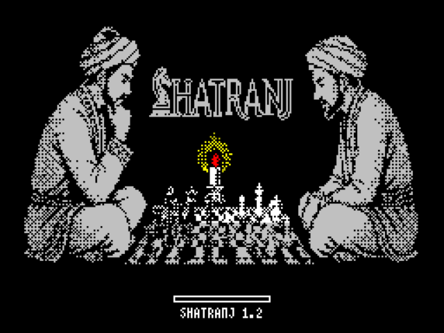<br>
  <sub>The guided Spectranext resource installer.</sub>
</p>

A GitHub Release ZIP is not a mountable Spectranext resource; enter the HTTPS
resource URL above instead.

## Quick start

1. Start Shatranj on both clients.
2. Choose **Host** on one client and **Guest** on the other.
3. Select **Direct** or **MQTT** on both sides.
4. For Direct, enter the host address and port on the guest. For MQTT, enter
   the same broker, port, and room on both clients.
5. The host chooses the game color and starts the game. The guest waits for the
   connection and then plays when the turn indicator allows it.
6. Use the chat panel or the Spectrum text input to communicate during the game.

### Direct TCP

The host listens on the configured TCP port. Share that endpoint with the
guest and make sure firewalls and routing allow the connection. Direct mode
does not use an MQTT broker.

### MQTT

Both clients connect to the same broker and room. MQTT is useful when a direct
peer connection is inconvenient, provided both clients can reach that broker.

## Gallery

### Desktop

<table>
  <tr>
    <td align="center" width="50%"><strong>macOS — Direct guest</strong><br>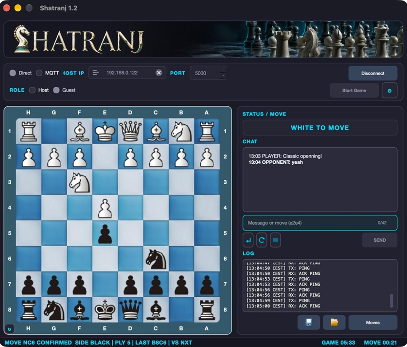</td>
    <td align="center" width="50%"><strong>Windows — MQTT game</strong><br>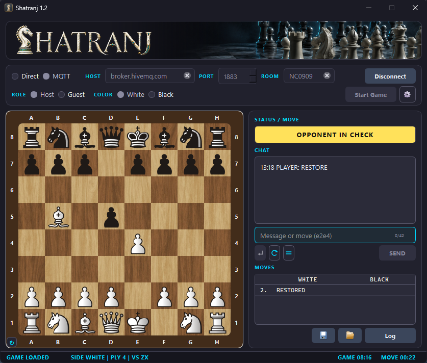</td>
  </tr>
  <tr>
    <td align="center" colspan="2"><strong>Linux — restored game</strong><br>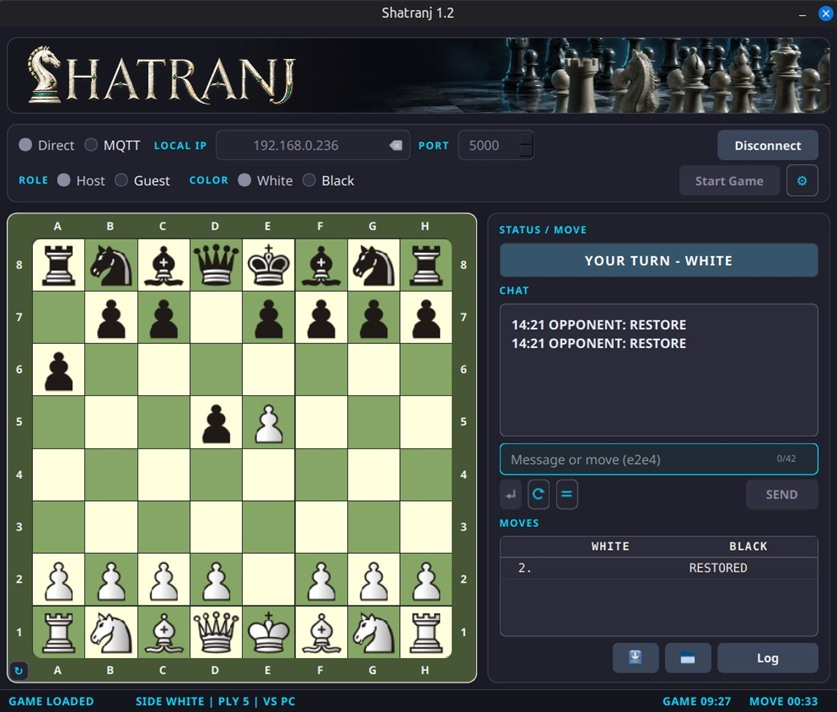</td>
  </tr>
</table>

### ZX Spectrum Classic

<table>
  <tr>
    <td align="center" width="50%"><strong>Setup and live preview</strong><br>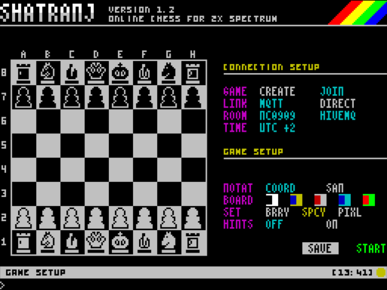</td>
    <td align="center" width="50%"><strong>Network game</strong><br>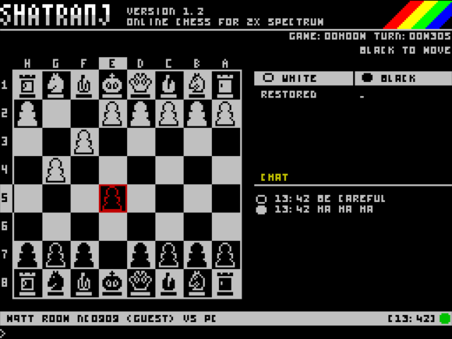</td>
  </tr>
  <tr>
    <td align="center"><strong>About</strong><br>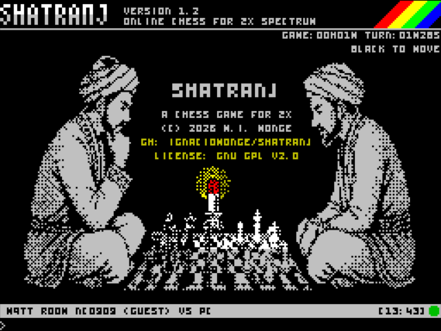</td>
    <td align="center"><strong>Alternative board theme</strong><br>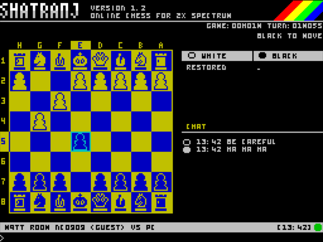</td>
  </tr>
</table>

### Spectrum Next

<table>
  <tr>
    <td align="center" width="50%"><strong>Setup with hardware sprites</strong><br>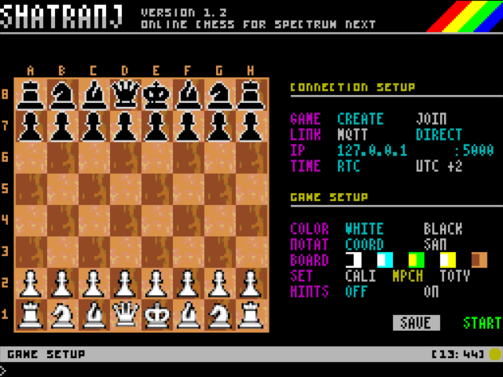</td>
    <td align="center" width="50%"><strong>Direct game and chat</strong><br>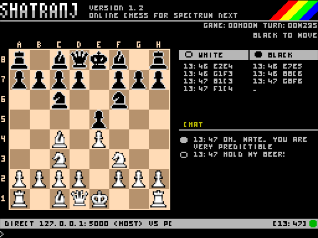</td>
  </tr>
  <tr>
    <td align="center" width="50%"><strong>Green board theme</strong><br>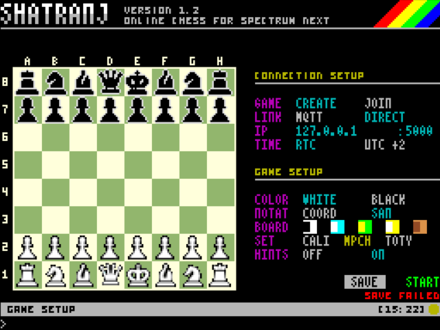</td>
    <td align="center" width="50%"><strong>In-game options</strong><br>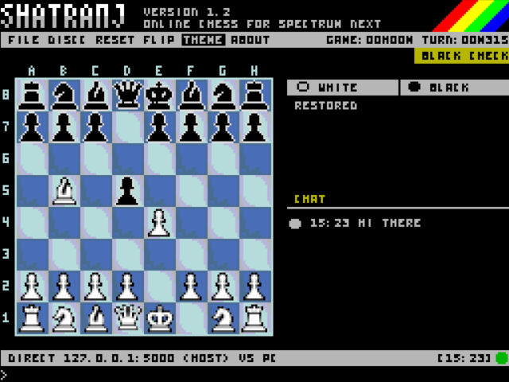</td>
  </tr>
</table>

### Spectranext

<table>
  <tr>
    <td align="center" width="50%"><strong>Legal-move hints</strong><br>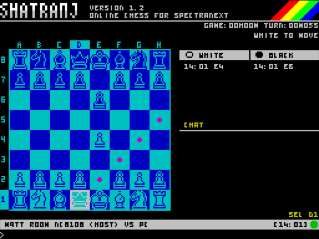</td>
    <td align="center" width="50%"><strong>Red and white theme</strong><br>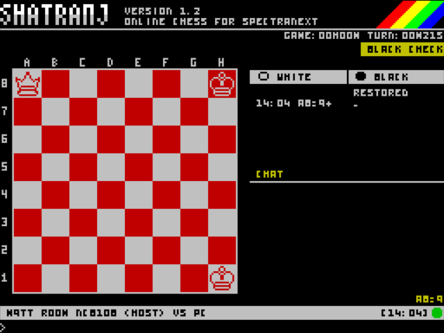</td>
  </tr>
  <tr>
    <td align="center" width="50%"><strong>Saved games</strong><br>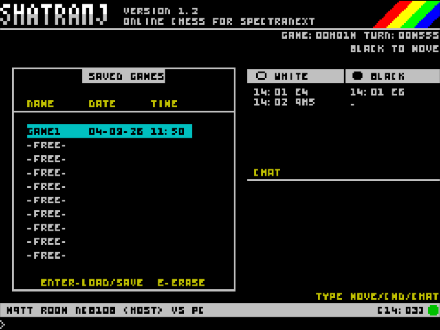</td>
    <td align="center" width="50%"><strong>In-game options</strong><br>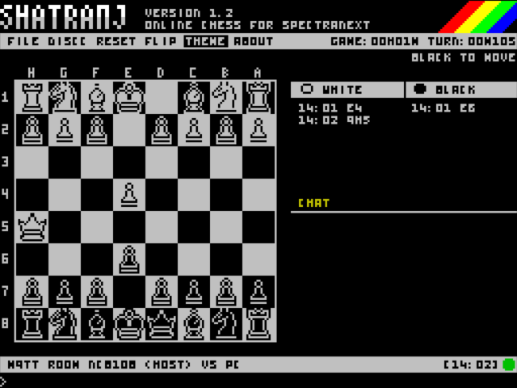</td>
  </tr>
</table>

## Piece sets and board themes

Themes and pieces are selected during Spectrum game setup.

### ZX Spectrum Classic and Spectranext

The Classic and Spectranext clients include three 16×16 piece sets — **BRRY**,
**SPCY**, and **PIXL** — plus five board palettes: **Classic**, **Blue**,
**Green**, **Cyan**, and **Magenta**.

<table>
  <tr>
    <th>Piece sets</th>
    <th>Board themes</th>
  </tr>
  <tr>
    <td align="center" width="34%">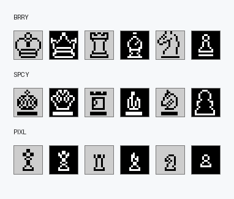</td>
    <td align="center" width="66%"></td>
  </tr>
</table>

### ZX Spectrum Next

The Next client uses 16×16 hardware sprites with three Lichess-derived piece
sets — **California**, **MPChess**, and **TotoY** — and five RGB333 board themes:
**Black & White**, **Blue 3**, **Green**, **Brown**, and **Wood**.

<table>
  <tr>
    <th>Next piece sets</th>
    <th>Next board themes</th>
  </tr>
  <tr>
    <td align="center" width="36%"></td>
    <td align="center" width="64%">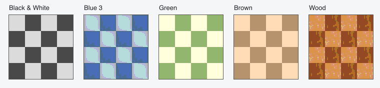</td>
  </tr>
</table>

## Using Shatranj

The host starts the game; either player can request a draw, takeback, restart,
or restoration of a compatible saved game. Moves are accepted only from the
side whose turn is shown.

### Desktop controls

| Action | Control |
| --- | --- |
| Configure a session | Select Direct or MQTT, Host or Guest, then enter the host address/port or broker/room |
| Move a piece | Click the source square and then the destination square |
| Send text or a coordinate move | Type in the chat/input line and press Enter |
| Save or restore | Use the save/load buttons or `/save [name]` and `/load [name]` |
| Inspect traffic | Open **Log** to view readable RX/TX protocol messages |
| Change appearance | Open **Settings** for board, pieces, notation, and hints |

The client remembers connection settings and recent valid Direct guest
addresses. It also shows game, turn, and move clocks.

### Spectrum controls

| Context | Control |
| --- | --- |
| Setup: move between rows | Cursor Up/Down or `Q`/`A` |
| Setup: change an option | Cursor Left/Right or `O`/`P` |
| Setup: edit or confirm | Space or Enter |
| Board: move the cursor | Cursor keys (`5`/`6`/`7`/`8`) or `Q`/`A`/`O`/`P` |
| Board: select source/destination | Space |
| Open and submit text input | Enter |
| Open the in-game menu | **EDIT** (`Caps Shift` + `1` on a classic keyboard) |
| FILE menu | `Q`/`A` selects a slot; Enter/Space loads or saves; `E` erases |

The in-game menu provides **FILE**, **DISCONNECT**, **RESET**, **FLIP**,
**THEME**, and **ABOUT**. In the menu, use Left/Right or `O`/`P`, then
Space/Enter.

### Text commands

| Input | Result | Availability |
| --- | --- | --- |
| `e2e4` | Submit a coordinate move | Qt and Spectrum |
| `/draw` | Offer a draw | Qt and Spectrum |
| `/resign` | Resign the current game | Qt and Spectrum |
| `/takeback` | Request undo of the last move | Qt and Spectrum |
| `/save [name]` | Save the current position locally | Qt; use FILE on Spectrum |
| `/load [name]` | Request restoration of a saved position | Qt; use FILE on Spectrum |

Any other submitted text is sent as chat. Qt asks for `q`, `r`, `b`, or `n`
on promotion; Spectrum clients promote to a queen automatically.

## Build from source

The repository Makefile is the supported entry point:

```sh
make tap              # classic TAP + OVL + DAT
make nex              # self-contained Spectrum Next NEX
make client-test      # Qt build and tests
make test             # shared and Spectrum host tests
```

`make tap` writes the Classic files to `release/`; keep its TAP, OVL, and DAT
together. `make nex` writes the self-contained Next image to
`release/Next/SHATRANJ.nex`.

## Development

See the [developer documentation](docs/README.md) for build requirements,
architecture, protocol specifications, and validation. Desktop-specific build
instructions are in the [Qt client guide](client/README.md).

## Credits and license

- **BRRY pieces:** based on [Chess Pieces 16×16 One-bit](https://berryarray.itch.io/chess-pieces-16x16-one-bit) by [BerryArray](https://berryarray.itch.io).
- **SPCY pieces:** based on [Chess Pieces](https://spicygame.itch.io/chess-pieces) by [Spicy Game](https://spicygame.itch.io).
- **PIXL pieces:** based on [Pixel Art Chess Pieces](https://benrosen.github.io/posts/pixel-art-chess-pieces/) by [Ben Rosen](https://benrosen.github.io).
- **Ikkle font:** [Ikkle 4](https://www.dafont.com/es/ikkle-4.font) by Brixdee, used as the basis for the compact Spectrum UI text.
- Third-party source and art retain their upstream licenses and notices.

Shatranj is free software released under the
[GNU General Public License v2.0](LICENSE). Third-party terms are listed in
[the notices file](THIRD_PARTY_NOTICES.md).

## Author

**M. Ignacio Monge Garcia — 2026**

Issues and contributions are welcome in the
[official repository](https://github.com/IgnacioMonge/Shatranj).

<p align="center"><sub>Connecting the ZX Spectrum to online chess since 2026.</sub></p>
